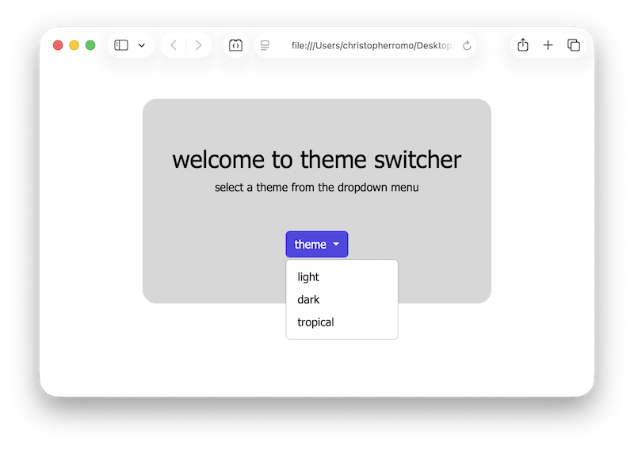
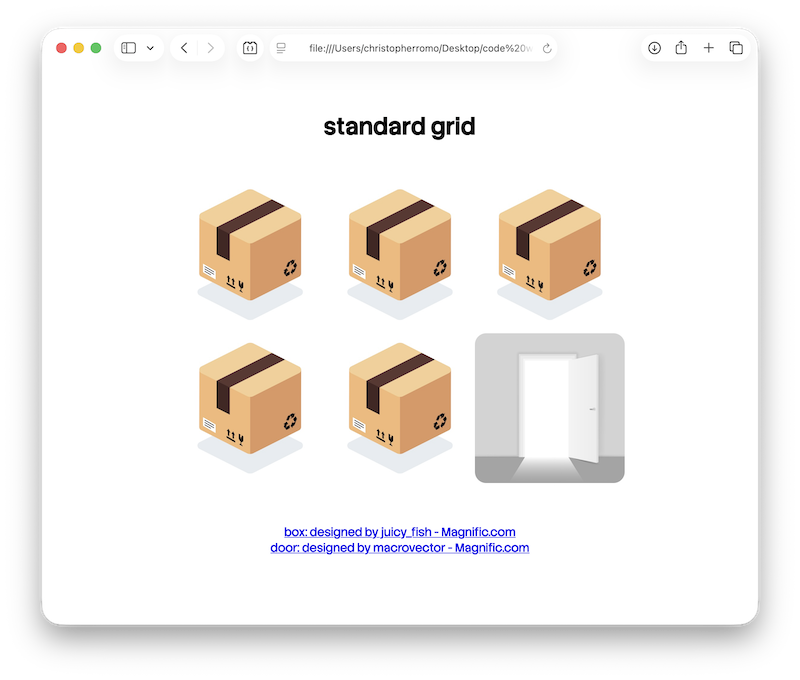

# CSS Workspace

These are mini-projects created to help me learn CSS.

## Theme Switcher Mini-Project

### Features 📄

- **CSS Variables:** Used to change UI colors across the page. Three themes exist: _light_, _dark_, and _tropical_. The light theme is the default theme defined in _:root_; the other themes are applied by adding a class to _body_.

- **Theme Switching:** Users can choose a theme from the dropdown. The dropdown calls a JavaScript function that removes the previous theme class and applies the selected theme to _body_.

- **Bootstrap:** Added to the project via `index.html` (stylesheet link and JavaScript link in _head_ tag). The dropdown is a Bootstrap UI component, and its colors update with the active theme.

### Running the Project 🎬

1. Clone the repository.

2. Open `index.html` in a browser.

### Quick Look 📷

  

## Warehouse Mini-Project

### Features 📄

- **CSS Grid:** Used to create different layouts. Explored properties include _grid-template-columns/rows_, _grid-template-areas_, and _grid-auto-flow_. Explored property values include the _repeat()_ function, _fr_, _span_, _auto-fit_, and _minmax_.

### Running the Project 🎬

1. Clone the repository.

2. Open `index.html` in a browser.

### Quick Look 📷

  

