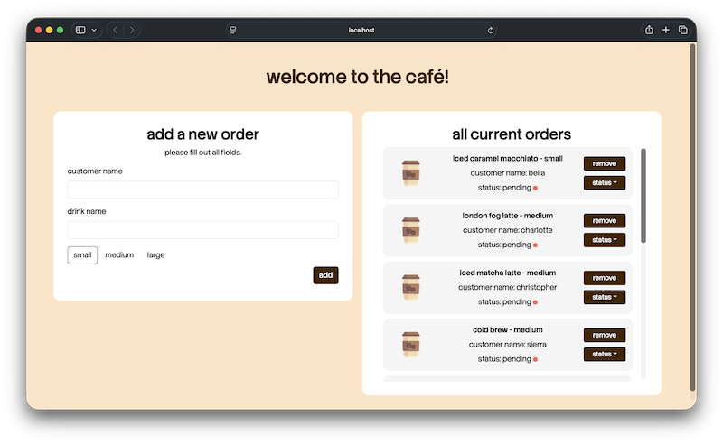
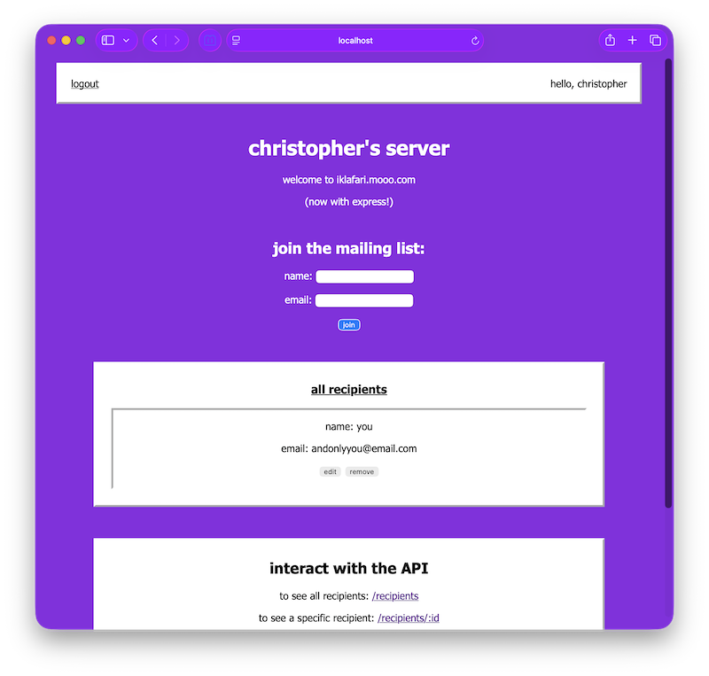

# Express Workspace

These are mini-projects created to help me learn Express.

## Cafe API Mini-Project

### Features 📄

   - **server.js:** The entry point for the project, where the Express app is created, JSON middleware is enabled, the */orders* router is mounted, and the server is started on port `3000`.

   - **Routes:** Defines the API endpoints for order requests. The orders router supports *GET*, *POST*, *PUT*, and *DELETE* requests. It calls functions in `ordersControllers.js` to handle requests.

   - **Controllers:** Defines functions that handle the request logic for getting all orders, finding an order by ID, creating a new order, updating an existing order, and deleting an order.

### Running the Project 🎬

1. Clone the repository.

2. Ensure Node.js is installed on your computer.

3. Open a terminal in the `cafe api mini-project/` directory.

4. Install dependencies:
    ```bash
    npm install
    ```

5. Run the project:
    ```bash
    npm run start
    ```

## Cafe App Mini-Project

### Features 📄

   - **Static Files:** Located in the `public/` directory, these files are now served via Express. A webpage now greets the user, and API requests can be made using the various UI components.

   - **Imported Font:** The font for the webpage has been imported from Google Fonts, with links located in the *head* tag in `index.html` and the font itself declared in `styles.css`.

   - **Bootstrap:** Added to the project via `index.html` (stylesheet link and JavaScript link in *head* tag), various Bootstrap UI components are used on the webpage. This includes form controls and dropdowns.

### Running the Project 🎬

1. Clone the repository.

2. Ensure Node.js is installed on your computer.

3. Open a terminal in the `cafe app mini-project/` directory.

4. Install dependencies:
    ```bash
    npm install
    ```

5. Run the project:
    ```bash
    npm run start
    ```

### Quick Look 📷

<p align="center">
  
</p>

## iklafari.mooo.com Refactor Mini-Project

### Features 📄

   - **express-session Middleware:** Used to create sessions for logged-in users. When a user logs in, a session is created, allowing for authentication for protected endpoints and site personalization.

   - **Validation & Security:** User input is validated on the back end, ensuring that accounts and recipients meet certain criteria before database insertion. Passwords are hashed using the bcrypt library, sessions are regenerated upon login, and `session.js` contains several configurations that build security.

   - **Refactor & New Features:** This refactor is based off of *project 8 - polling* from *web-programming-projects*. Originally, URL query parameters and partial recipient updates were removed when the database was introduced. Those features have been restored, along with a replacement for basic authentication and a way to cycle through the site's previous page colors.

### Running the Project 🎬

1. Clone the repository.

2. Ensure Node.js is installed on your computer.

3. Create a `data/` directory in the `iklafari.mooo.com refactor mini-project/` directory.

4. Create a `.env` file in the `iklafari.mooo.com refactor mini-project/` directory.

5. Add the following to the `.env` file, with your own configuration.
    ```
    SESSION_SECRET=your_session_secret_here
    ```

6. Open a terminal in the `iklafari.mooo.com refactor mini-project/` directory.

7. Install dependencies:
    ```bash
    npm install
    ```

8. Initialize database:
    ```bash
    npm run db:init
    ```

9. Run the project:
    ```bash
    npm run start
    ```

### Quick Look 📷

<p align="center">
  
</p>
