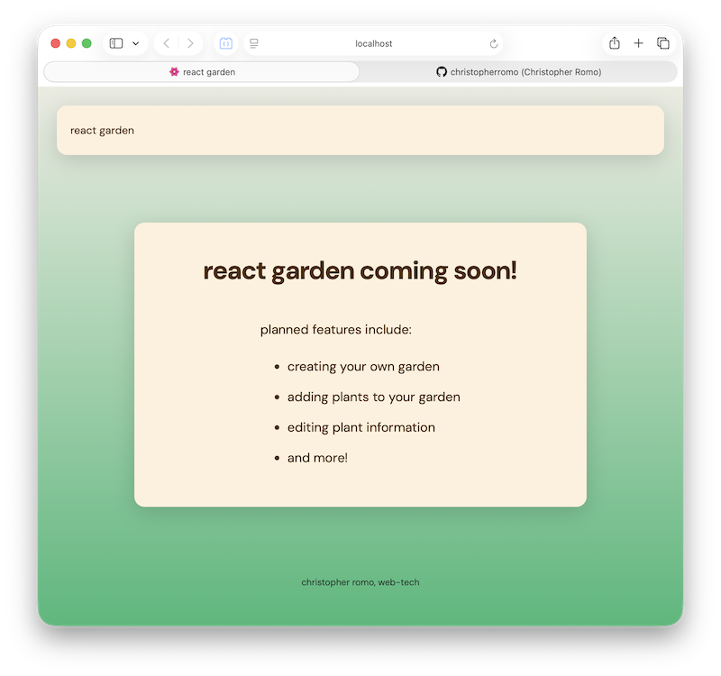

# React Workspace

These are mini-projects created to help me learn React.

## React Garden Sprint 1 Mini-Project

### Features 📄

   - **React Static Page:** Created using React components. The page (app) consists of three components: the navbar, the main content, and the footer. This mini-project was made to help introduce me to React.

   - **Vite Scaffold:** Used to setup the mini-project. This allowed me to learn the typical project structure and have access to developer tools. This was important to learn for setting up future projects.

### Running the Project 🎬

1. Clone the repository.

2. Ensure Node.js is installed on your computer.

3. Open a terminal in the `react garden sprint 1 mini-project/` directory.

4. Install dependencies:
    ```bash
    npm install
    ```

5. Run the project:
    ```bash
    npm run dev
    ```

### Quick Look 📷

<p align="center">
  
</p>
