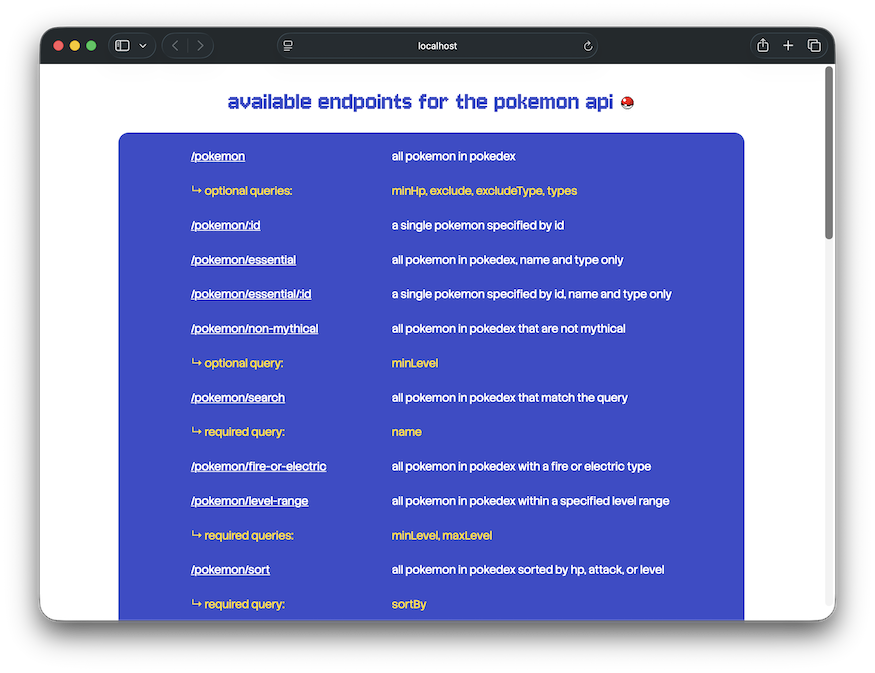
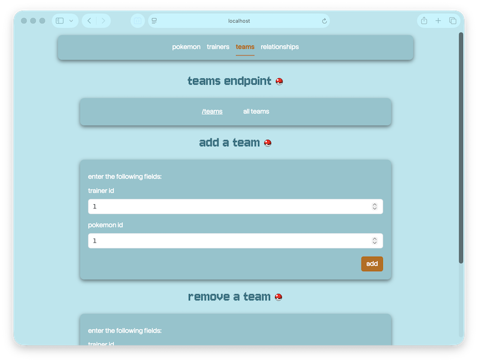

# SQL Workspace

These are mini-projects created to help me learn SQL.

## Pokemon API Mini-Project

### Features 📄

   - **better-sqlite3 database:** Uses better-sqlite3 library for a lightweight database. `database.js` creates the database connection, `schema.js` builds the pokedex table, and `seed.js` loads 25 Pokemon.

   - **Model layer:** Keeps the SQL query logic in one place. Controllers request data from the model, and the model handles the actual *SELECT*, *INSERT*, *UPDATE*, and *DELETE* statements.

   - **SQL-focused endpoints:** Includes routes that practice common SQL patterns and operators, such as */fire-or-electric* for *OR*, */level-range* for *BETWEEN*, */sort* for *ORDER BY*, and */stats* for aggregate functions.

### Running the Project 🎬

1. Clone the repository.

2. Ensure Node.js is installed on your computer.

3. Create a `data/` directory in the `pokemon api mini-project/` directory.

4. Open a terminal in the `pokemon api mini-project/` directory.

5. Install dependencies:
    ```bash
    npm install
    ```

6. Initialize database:
    ```bash
    npm run db:init
    ```

7. Run the project:
    ```bash
    npm run start
    ```

### Quick Look 📷

<p align="center">
  
</p>

## Pokemon League API Mini-Project

### Features 📄

   - **PostgreSQL database:** Uses node-postgres library for a more powerful database. `database.js` creates the database connection, `schema.sql` builds the various tables, and `seed.sql` populates the tables.

   - **Migrations:** Migrations were explored, located in the `migrations/` directory. These 5 SQL files utilize the *ALTER TABLE* statement, allowing for the pokemon table to be altered.

   - **Model layer:** Keeps the SQL query logic in one place. Controllers request data from the model, and the model handles the actual *SELECT*, *INSERT*, and *DELETE* statements.

   - **SQL-focused endpoints:** Includes routes that practice more SQL patterns and operators, such as */teams* for *INNER JOIN*, */relationships* for *FULL JOIN*, and */pokemon/types* for *DISTINCT*.

### Running the Project 🎬

1. Clone the repository.

2. Ensure Node.js & PostgreSQL are installed on your computer.

3. Create a `.env` file in the `pokemon league api mini-project/` directory.

4. Add the following to the `.env` file, with your own configurations.
    ```
    DB_USER=your_db_user_here
    DB_PASSWORD=your_db_password_here
    DB_HOST=localhost
    DB_PORT=5432
    DB_NAME=pokemon_league
    ```

5. Open a terminal in the `pokemon league api mini-project/` directory.

6. Install dependencies:
    ```bash
    npm install
    ```

7. Initialize database:
    ```bash
    npm run db:init
    ```

8. Run the project:
    ```bash
    npm run start
    ```

### Quick Look 📷

<p align="center">
  
</p>
